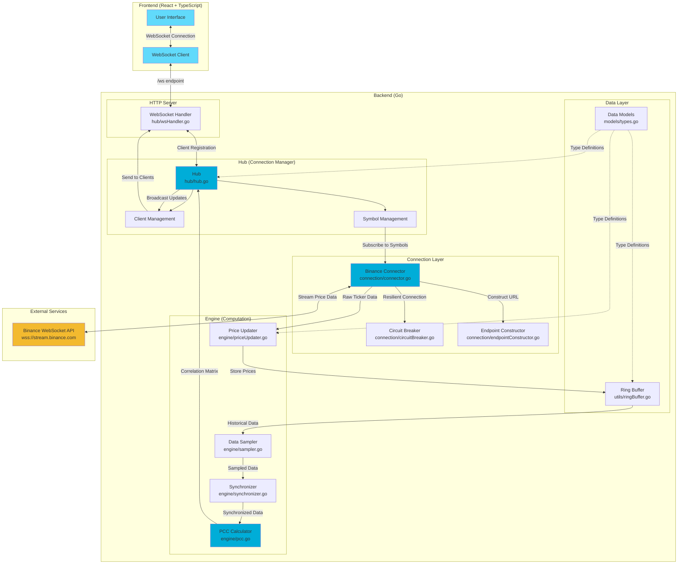

# CryptoPulse

🚀 CryptoPulse
CryptoPulse is a high-concurrency market analysis engine built in Go that calculates real-time Pearson Correlation Coefficients (PCC) between cryptocurrency assets. By streaming live trade data via the Binance WebSocket API, it visualizes hidden market relationships with sub-100ms latency.

🔗 Live Website: https://cryptopulseapp.dev

## Architecture

## 🛠 Technical Architecture
The system is designed with a Hub-and-Spoke concurrency model to handle high-frequency data streams without blocking or race conditions.

### Key Engineering Features:
- **Online Algorithm Logic**: Utilizes an incremental calculation engine to process trade events as they arrive, avoiding heavy batch processing.

- **Sliding Window Analytics**: Implements a rolling temporal window for sampling, ensuring that correlation data reflects immediate market shifts rather than historical noise.

- **Smart Resource Reclamation**: Features a reference-counting lifecycle manager that automatically terminates unused WebSocket feeds when users disconnect, optimizing CPU and network usage.

- **Resiliency (Circuit Breaker)**: Implements a custom Circuit Breaker with exponential backoff to handle external API instability and rate-limiting gracefully.

- **Memory Optimization**: Uses sync.Pool for buffer reuse to minimize Garbage Collection (GC) overhead during high-frequency JSON broadcasting.

## 🏗 System Design
- **Backend**: Golang (Gorilla WebSockets, slog)

- **Frontend**: React, Vite, Tailwind CSS

- **Reverse Proxy**: Caddy (SSL/TLS termination, High-performance routing)

- **Infrastructure**: Docker, Docker Compose, Oracle Cloud (OCI)

## 📊 Numerical Stability & Math
Calculating correlation across assets with vastly different price scales (e.g., BTC at $40k vs. SHIB at $0.00001) requires careful normalization. CryptoPulse handles this by:

1. **Normalizing quote-asset volatility**.

2. **Synchronizing disparate price update frequencies** into a unified sampling window.

3. **Handling "Denominator Bias"** to ensure catastrophic cancellation doesn't happen and the Pearson Correlation Coefficient(PCC) calculation remains numerically stable.

## Pearson Correlation Coefficient

The Pearson Correlation Coefficient (PCC) measures the linear relationship between two price series. The formula is:

$$
r = \frac{\sum_{i=1}^{n}(x_i - \bar{x})(y_i - \bar{y})}{\sqrt{\sum_{i=1}^{n}(x_i - \bar{x})^2}\sqrt{\sum_{i=1}^{n}(y_i - \bar{y})^2}}
$$

Where:
- $r$ is the correlation coefficient ranging from $-1$ to $1$
- $x_i, y_i$ are the individual price points
- $\bar{x}, \bar{y}$ are the mean prices
- $n$ is the sample size

The implementation uses a numerically stable online algorithm for efficient real-time computation.

<!-- 
### Component Descriptions

#### Frontend Layer
- **User Interface**: React-based web application for selecting cryptocurrency pairs and visualizing correlation matrices
- **WebSocket Client**: Manages real-time bidirectional communication with the backend server

#### Backend Layer

**HTTP Server**
- **WebSocket Handler**: Handles WebSocket upgrade requests and manages client connections at `/ws` endpoint

**Hub (Connection Manager)**
- **Hub**: Central coordinator managing client connections, symbol subscriptions, and data broadcasting
- **Client Management**: Tracks connected clients, their symbol preferences, and manages message delivery
- **Symbol Management**: Maintains active symbol subscriptions and coordinates with Binance connectors

**Engine (Computation)**
- **PCC Calculator**: Implements Pearson Correlation Coefficient algorithm for calculating correlations between price series
- **Data Sampler**: Samples price data from ring buffers to ensure consistent analysis windows
- **Synchronizer**: Aligns price data across different symbols by timestamp for accurate correlation calculations
- **Price Updater**: Processes incoming Binance ticker data and updates ring buffers with latest prices

**Connection Layer**
- **Binance Connector**: Establishes and maintains WebSocket connections to Binance streaming API
- **Circuit Breaker**: Implements fault tolerance with automatic reconnection and exponential backoff
- **Endpoint Constructor**: Builds Binance WebSocket URLs with multiple symbol subscriptions

**Data Layer**
- **Data Models**: Defines type structures for Binance tickers, symbol attributes, and internal data representations
- **Ring Buffer**: Fixed-size circular buffer for efficient storage of time-series price data

### Data Flow

1. **Client Connection**: User connects via WebSocket and requests specific cryptocurrency symbols
2. **Symbol Subscription**: Hub subscribes to requested symbols via Binance connector
3. **Price Streaming**: Binance streams real-time ticker data through resilient connection with circuit breaker
4. **Data Storage**: Price updater stores incoming prices in ring buffers for each symbol
5. **Sampling**: Sampler extracts fixed-size data windows from ring buffers
6. **Synchronization**: Synchronizer aligns price series by timestamp across symbols
7. **Correlation Calculation**: PCC engine computes correlation matrix for all symbol pairs
8. **Broadcasting**: Hub broadcasts correlation matrices to all connected clients
9. **Visualization**: Frontend receives and displays live correlation data -->
